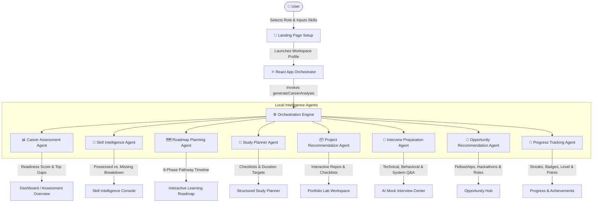

# 🚀 CareerPilot AI — Career OS & Learning Companion

> An advanced, multi-agent AI-powered Career Operating System designed to assess skill gaps, map 8-phase pathways, curate resources, recommend projects, simulate interviews, and track gamified achievements.

---

## 🗺️ System Architecture & User Flow

The following diagram illustrates how user profiles feed into the **Multi-Agent Orchestration Hub** (`localEngine.js`) to drive the entire application lifecycle.



---

## 🌟 Key Features

CareerPilot AI operates as a unified workspace offering several features tailored to any selected career path:

1. **Dashboard & Summary Analytics**: High-level view of your career readiness score, active streaks, current level, points, and immediate action items.
2. **Career Assessment Agent**: Calculates a weighted career readiness score across foundations (40%), core (35%), projects (15%), and interview prep (10%). Categorizes the candidate's level from *Starter Phase* to *Elite Expert*.
3. **Skill Intelligence Agent**: Performs fuzzy-matching on your input skills profile against industry standards, categorizing them into Strong, Intermediate, Weak, and Missing skill categories.
4. **Roadmap Planning Agent**: Builds an 8-phase personalized roadmap (Foundations, Programming, Core Tech, Projects, Specialization, Portfolio, Interview Prep, Job Search) with hourly expectations and custom milestones.
5. **Study Planner Agent**: Designs tailored schedules including Daily, Weekly, Monthly, and Quarterly action plans to help bridge active skill gaps.
6. **Portfolio Lab**: Recommends customized, highly relevant portfolio projects mapped by difficulty (Beginner, Intermediate, Advanced) containing detailed development guidelines and deployment checklists.
7. **Interview Center**: Conducts AI-driven mock interviews using behavioral questions, technical coding prompts, and system design challenges with built-in feedback loops.
8. **Opportunity Hub**: Matches users with real-world programs, fellowships, hackathons, and paid remote internships corresponding to their target paths.
9. **Achievements & Certificate Console**: Rewards progress with unlocked badges, XP updates, and dynamic certificate generations upon milestone completion.

---

## 🛠️ Technology Stack

- **Frontend Core**: [React (v18)](https://react.dev/) & [Vite](https://vite.dev/)
- **Icons**: [Lucide React](https://lucide.dev/)
- **State Persistence**: HTML5 `localStorage` API
- **Styling**: Modern Vanilla CSS containing extensive design tokens, HSL color palettes, responsive flex/grid wrappers, and dark mode aesthetics.

---

## 📁 Repository Structure

```text
├── src/
│   ├── components/            # Reusable UI layout elements
│   │   ├── CareerRoadmap.jsx       # Custom step timeline builder
│   │   ├── JobRoleExplorer.jsx     # Career switcher component
│   │   ├── LandingPage.jsx         # Setup console for new profiles
│   │   ├── Overview.jsx            # Summary view of main metrics
│   │   ├── ProjectsLab.jsx         # Interactive portfolio cards
│   │   ├── Sidebar.jsx             # Workspace navigation controller
│   │   ├── SkillProgressTracker.jsx# Progress bars & radar mappings
│   │   └── StudyPlanner.jsx        # Schedule trackers
│   ├── pages/                 # Full screen view routes
│   │   ├── Achievements.jsx        # Badge cabinet & certificate drawer
│   │   ├── CareerAssessment.jsx    # Strengths/Weaknesses overview
│   │   ├── Dashboard.jsx           # Core workspace home page
│   │   ├── InterviewCenter.jsx     # Behavioral & technical prep
│   │   ├── LearningHub.jsx         # Curated docs & videos library
│   │   ├── LearningRoadmap.jsx     # Master 8-phase curriculum page
│   │   ├── OpportunityHub.jsx      # Fellowship & Hackathon filters
│   │   ├── PortfolioLab.jsx        # Project implementation board
│   │   ├── ProgressAnalytics.jsx   # Metrics, charts, & performance grids
│   │   ├── SkillIntelligence.jsx   # Deep-dive skill gaps console
│   │   └── StudyPlanner.jsx        # Focus schedules controller
│   ├── services/              # Logic engines and knowledge stores
│   │   ├── dataStore.js            # Pre-seeded database for 9 career roles
│   │   └── localEngine.js          # Multi-agent analysis orchestration
│   ├── styles/                # CSS Stylesheets
│   ├── App.jsx                # App bootstrap & view state router
│   └── main.jsx               # React DOM rendering entrypoint
├── index.html                 # HTML shell
├── package.json               # Package manifests
└── vite.config.js             # Vite compiler config
```
