# 🚀 CareerPilot AI — Professional Career Operating System

> An advanced, multi-agent AI-powered Career Operating System designed to assess skill gaps, map 8-phase pathways, curate resources, recommend projects, simulate interviews, and track gamified achievements.

---

[](https://careerpilot-ai-zeta-blush.vercel.app)

---

##  Project Overview

CareerPilot OS is a professional, local-first SaaS platform that functions as a personal career cockpit. By leveraging local multi-agent intelligence, it dynamically maps out, audits, and accelerates individual learning paths for 9 major software development, data science, and security roles. 

## ✨ Features

### 📊 Dashboard
- Career Readiness Score
- XP & Level Progress
- Daily Focus
- Learning Priorities

### 🎯 Career Assessment
- Skill Gap Analysis
- Readiness Score
- Strength & Weakness Detection

### 🧠 Skill Intelligence
- Strong Skills
- Intermediate Skills
- Missing Skills
- Priority Recommendations

### 🛣 Learning Roadmap
- 8 Learning Phases
- Interactive Milestones
- Progress Tracking

### 📅 Study Planner
- Daily Tasks
- Weekly Goals
- Monthly Milestones
- Quarterly Reviews

### 💼 Portfolio Lab
- Recommended Projects
- GitHub Checklist
- Deployment Checklist

### 🎤 Interview Center
- Behavioral Questions
- Technical Questions
- System Design Questions

### 🌍 Opportunity Hub
- Internships
- Certifications
- Fellowships
- Hackathons

### 🏆 Achievements
- XP System
- Badges
- Certificates

---
##  Why CareerPilot OS

Unlike static checklists, CareerPilot OS provides a closed-loop system where completed tasks automatically update XP, extend streaks, unlock badges, and recalculate career readiness in real-time, providing immediate feedback.

---

# 🛠 Technology Stack

| Technology | Purpose |
|------------|----------|
| React 18 | Frontend |
| Vite | Build Tool |
| Vanilla CSS | Styling |
| Lucide React | Icons |
| LocalStorage | Persistence |
| JavaScript | Logic |

---

# 🏗 Architecture

The application follows a modular architecture where a centralized analysis engine coordinates multiple specialized agents to generate personalized recommendations.


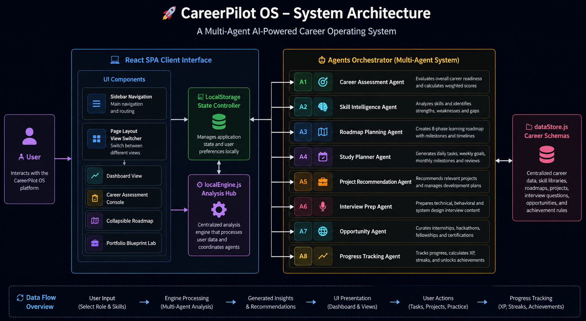


---

# 📂 Project Structure

```text
CareerPilot-AI/
│
│
├── src/
│   ├── components/
│   │   ├── LandingPage.jsx
│   │   ├── Sidebar.jsx
│   │   └── ...
│   │
│   ├── pages/
│   │   ├── Dashboard.jsx
│   │   ├── CareerAssessment.jsx
│   │   ├── LearningRoadmap.jsx
│   │   ├── StudyPlanner.jsx
│   │   ├── PortfolioLab.jsx
│   │   ├── InterviewCenter.jsx
│   │   ├── OpportunityHub.jsx
│   │   ├── ProgressAnalytics.jsx
│   │   └── Achievements.jsx
│   │
│   ├── services/
│   │   ├── localEngine.js
│   │   └── dataStore.js
│   │
│   ├── styles/
│   │   ├── app.css
│   │   ├── dashboard.css
│   │   ├── components.css
│   │   ├── variables.css
│   │   └── utilities.css
│   │
│   ├── App.jsx
│   └── main.jsx
│
├── package.json
├── README.md
└── vite.config.js
```


# 📚 Documentation

###  Sequence Diagram: Application Launch
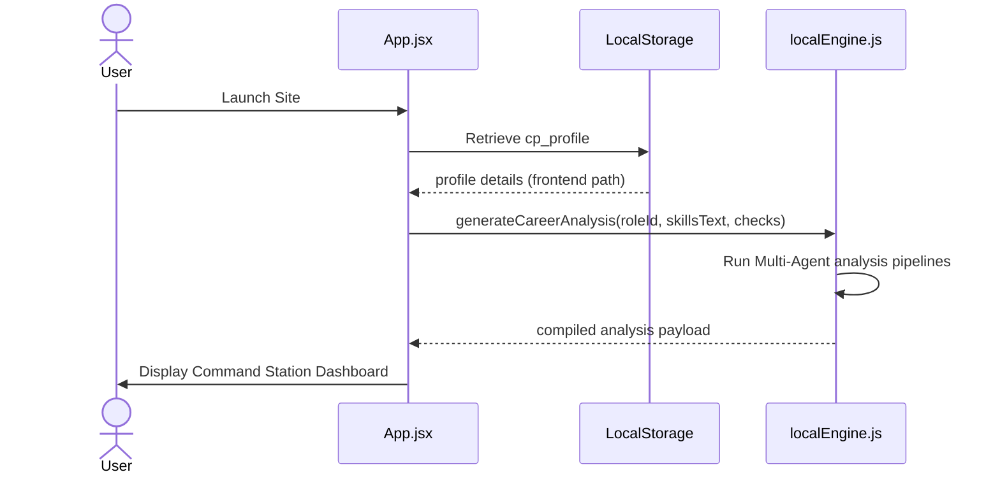
```mermaid
sequenceDiagram
    actor User
    participant App as App.jsx
    participant Storage as LocalStorage
    participant Engine as localEngine.js
    
    User->>App: Launch Site
    App->>Storage: Retrieve cp_profile
    Storage-->>App: profile details (frontend path)
    App->>Engine: generateCareerAnalysis(roleId, skillsText, checks)
    Engine->>Engine: Run Multi-Agent analysis pipelines
    Engine-->>App: compiled analysis payload
    App->>User: Display Command Station Dashboard
```


<details>

###  User Journey
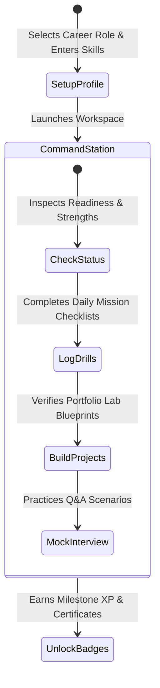
```mermaid
stateDiagram-v2
    [*] --> SetupProfile : Selects Career Role & Enters Skills
    SetupProfile --> CommandStation : Launches Workspace
    state CommandStation {
        [*] --> CheckStatus : Inspects Readiness & Strengths
        CheckStatus --> LogDrills : Completes Daily Mission Checklists
        LogDrills --> BuildProjects : Verifies Portfolio Lab Blueprints
        BuildProjects --> MockInterview : Practices Q&A Scenarios
    }
    CommandStation --> UnlockBadges : Earns Milestone XP & Certificates
```

###  Multi-Agent Architecture
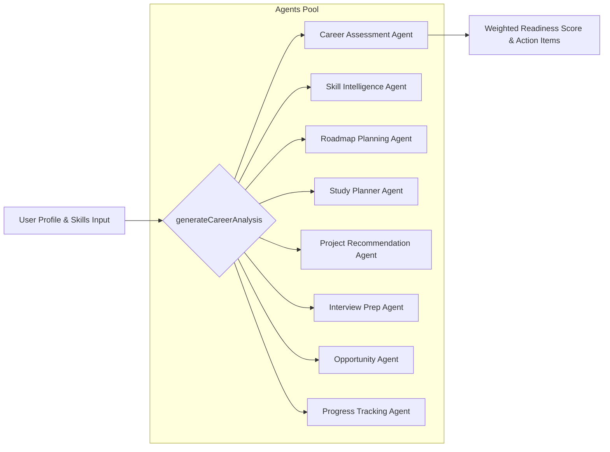
```mermaid
graph LR
    input[User Profile & Skills Input] --> Orchestrator{generateCareerAnalysis}
    subgraph Agents Pool
        Orchestrator --> A1[Career Assessment Agent]
        Orchestrator --> A2[Skill Intelligence Agent]
        Orchestrator --> A3[Roadmap Planning Agent]
        Orchestrator --> A4[Study Planner Agent]
        Orchestrator --> A5[Project Recommendation Agent]
        Orchestrator --> A6[Interview Prep Agent]
        Orchestrator --> A7[Opportunity Agent]
        Orchestrator --> A8[Progress Tracking Agent]
    end
    A1 --> output[Weighted Readiness Score & Action Items]
```
###  Career Analysis Workflow

```mermaid
flowchart TD
    Start([Initialize Analysis]) --> LoadRole[Load dataStore.js Role Specifications]
    LoadRole --> TokenizeSkills[Normalize Input Skills Array]
    TokenizeSkills --> RunFuzzyCheck[Run checkUserHasSkill fuzzy matching]
    RunFuzzyCheck --> CalcCategory[Calculate category sub-scores]
    CalcCategory --> CalcWeighted[Apply weights: Foundations 40%, Core 35%, Projects 15%, Interview 10%]
    CalcWeighted --> DetermineTier[Determine status tier Starter / Developing / Ready / Expert]
    DetermineTier --> OutputMetrics([Compile Analysis Payload])
```

###  Skill Assessment Workflow
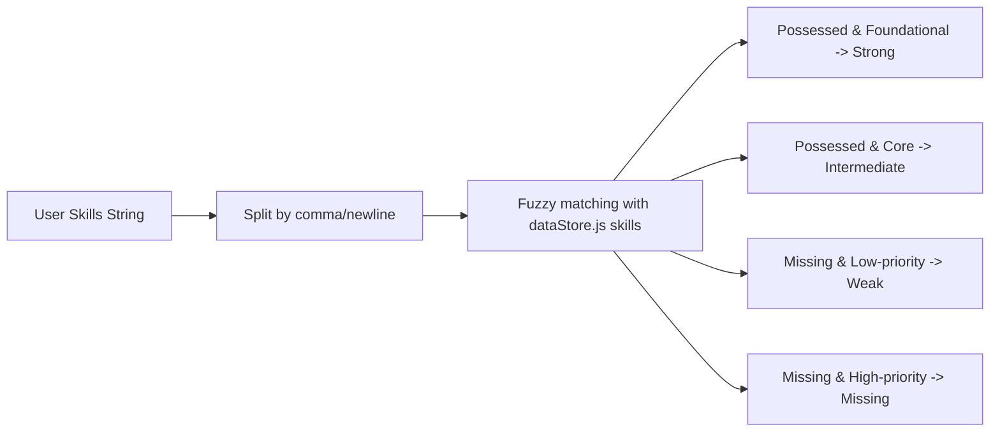
```mermaid
flowchart LR
    Start[User Skills String] --> Split[Split by comma/newline]
    Split --> Match[Fuzzy matching with dataStore.js skills]
    Match --> Strong[Possessed & Foundational -> Strong]
    Match --> Intermediate[Possessed & Core -> Intermediate]
    Match --> Weak[Missing & Low-priority -> Weak]
    Match --> Missing[Missing & High-priority -> Missing]
```

###  Roadmap Generation Workflow
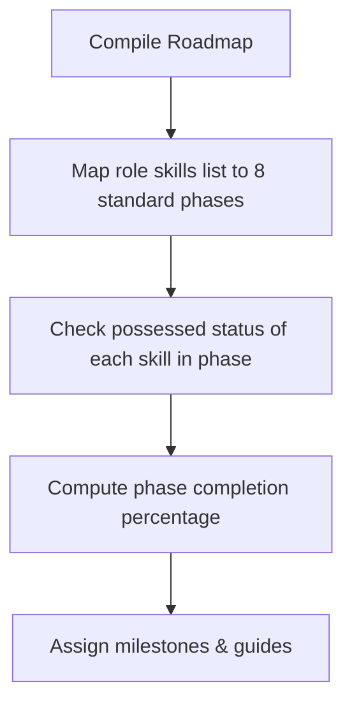
```mermaid
flowchart TD
    Start[Compile Roadmap] --> MapPhases[Map role skills list to 8 standard phases]
    MapPhases --> CheckStatus[Check possessed status of each skill in phase]
    CheckStatus --> CalcPercentage[Compute phase completion percentage]
    CalcPercentage --> FetchMilestones[Assign milestones & guides]
```

###  Study Planner Workflow
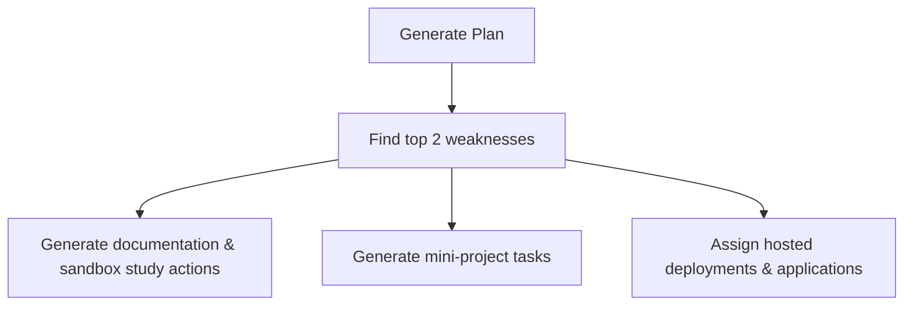
```mermaid
flowchart TD
    Start[Generate Plan] --> IdentifyGaps[Find top 2 weaknesses]
    IdentifyGaps --> DailyDrill[Generate documentation & sandbox study actions]
    IdentifyGaps --> WeeklyGoal[Generate mini-project tasks]
    IdentifyGaps --> MonthQuarter[Assign hosted deployments & applications]
```

###  Portfolio Recommendation Workflow
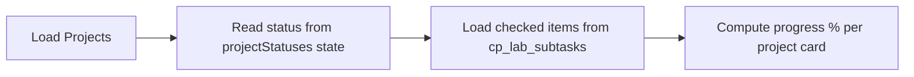
```mermaid
flowchart LR
    Start[Load Projects] --> MapStatus[Read status from projectStatuses state]
    MapStatus --> SubtaskCheck[Load checked items from cp_lab_subtasks]
    SubtaskCheck --> CalcPercent[Compute progress % per project card]
```

###  Interview Generation Workflow
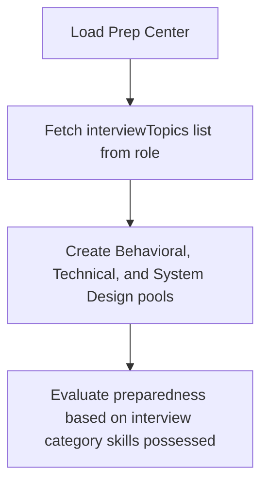
```mermaid
flowchart TD
    Start[Load Prep Center] --> FetchQuestions[Fetch interviewTopics list from role]
    FetchQuestions --> GenCategories[Create Behavioral, Technical, and System Design pools]
    GenCategories --> CalcScore[Evaluate preparedness based on interview category skills possessed]
```

###  Opportunity Recommendation Workflow
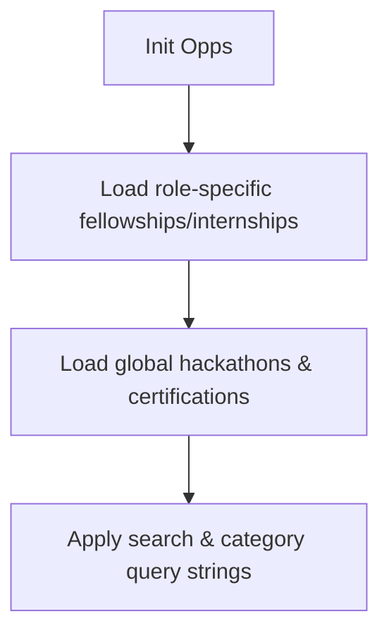
```mermaid
flowchart TD
    Start[Init Opps] --> LoadRoleOpps[Load role-specific fellowships/internships]
    LoadRoleOpps --> LoadGlobal[Load global hackathons & certifications]
    LoadGlobal --> FilterQuery[Apply search & category query strings]
```

###  Progress Tracking Workflow
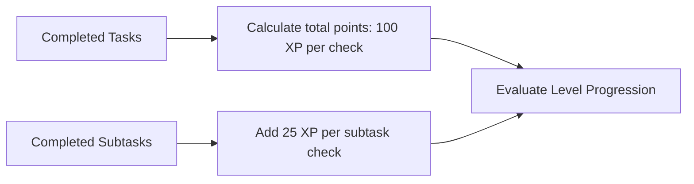
```mermaid
flowchart LR
    Tasks[Completed Tasks] --> CalcPoints[Calculate total points: 100 XP per check]
    Subtasks[Completed Subtasks] --> AddSubPoints[Add 25 XP per subtask check]
    CalcPoints & AddSubPoints --> NextLevel[Evaluate Level Progression]
```

###  Application State Flow
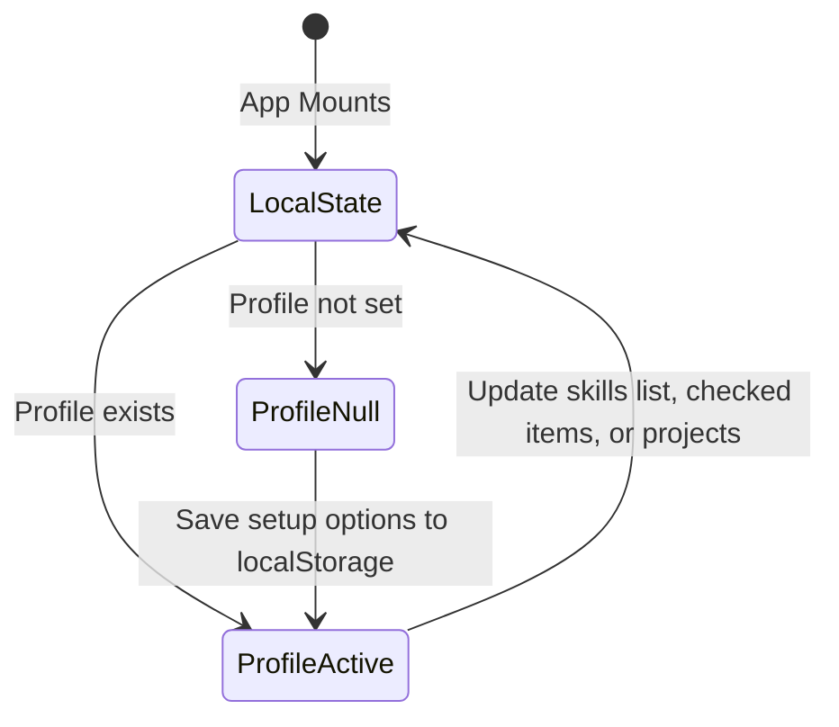
```mermaid
stateDiagram-v2
    [*] --> LocalState : App Mounts
    LocalState --> ProfileNull : Profile not set
    LocalState --> ProfileActive : Profile exists
    ProfileNull --> ProfileActive : Save setup options to localStorage
    ProfileActive --> LocalState : Update skills list, checked items, or projects
```

###  Component Interaction Diagram
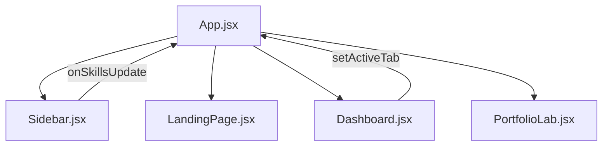
```mermaid
graph TD
    App[App.jsx] --> Sidebar[Sidebar.jsx]
    App --> LandingPage[LandingPage.jsx]
    App --> Dashboard[Dashboard.jsx]
    App --> PortfolioLab[PortfolioLab.jsx]
    Sidebar -->|onSkillsUpdate| App
    Dashboard -->|setActiveTab| App
```

###  Data Flow Diagram
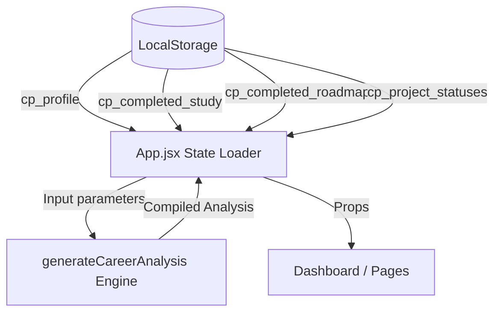
```mermaid
flowchart TD
    Store[(LocalStorage)] -->|cp_profile| App[App.jsx State Loader]
    Store -->|cp_completed_study| App
    Store -->|cp_completed_roadmap| App
    Store -->|cp_project_statuses| App
    App -->|Input parameters| Engine[generateCareerAnalysis Engine]
    Engine -->|Compiled Analysis| App
    App -->|Props| Views[Dashboard / Pages]
```

</details>


---

# 📸 Screenshots
---

# 📸 Application Screenshots

| Landing Page | Dashboard |
|--------------|-----------|
| 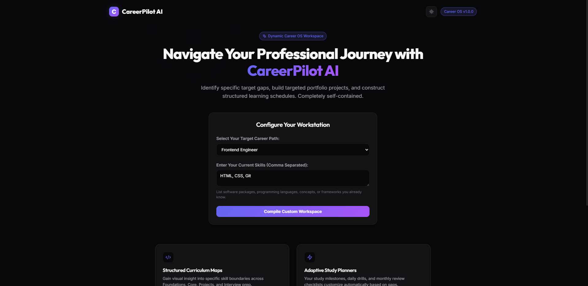 | 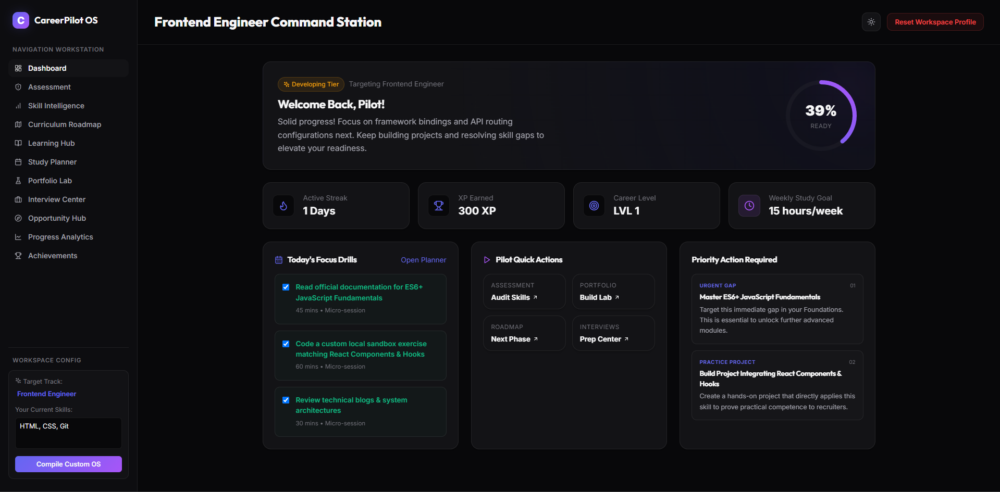 |

| Career Assessment | Skill Intelligence |
|-------------------|--------------------|
| 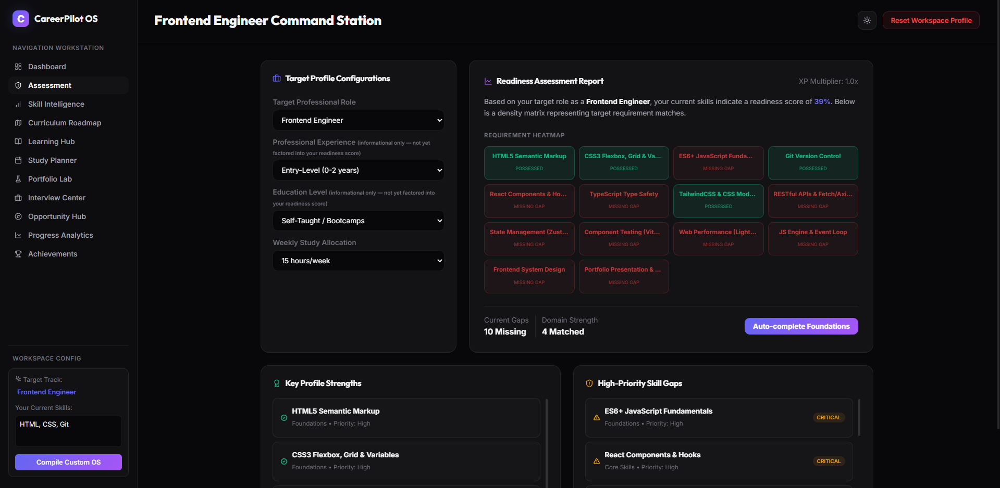 | 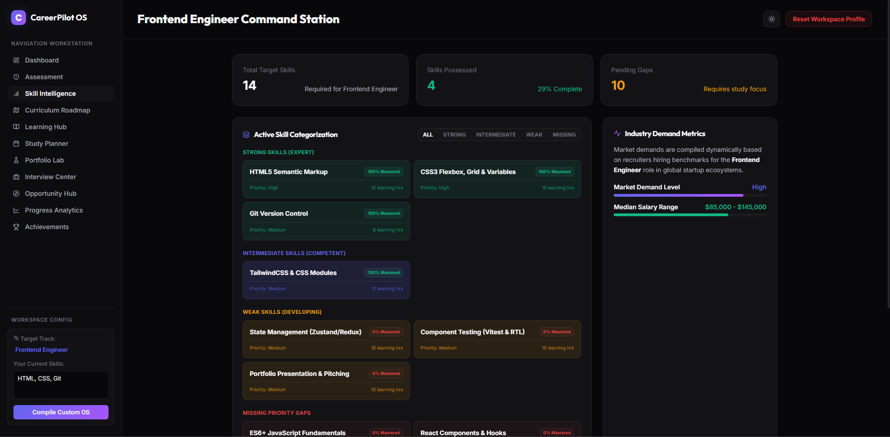 |

| Curriculum Roadmap | Learning Hub |
|------------------|---------------|
| 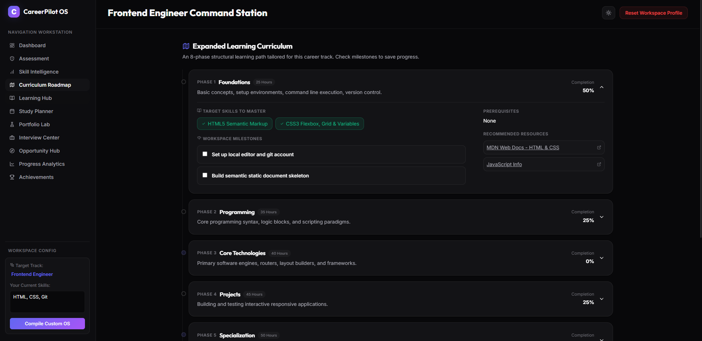 | 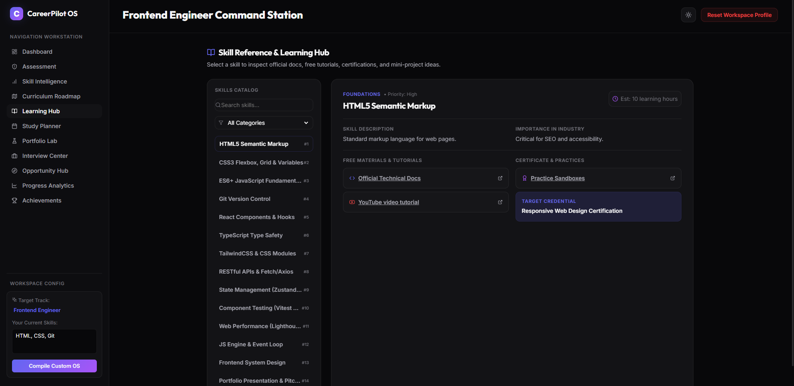 |

| Study Planner | Portfolio Lab |
|---------------|------------------|
| 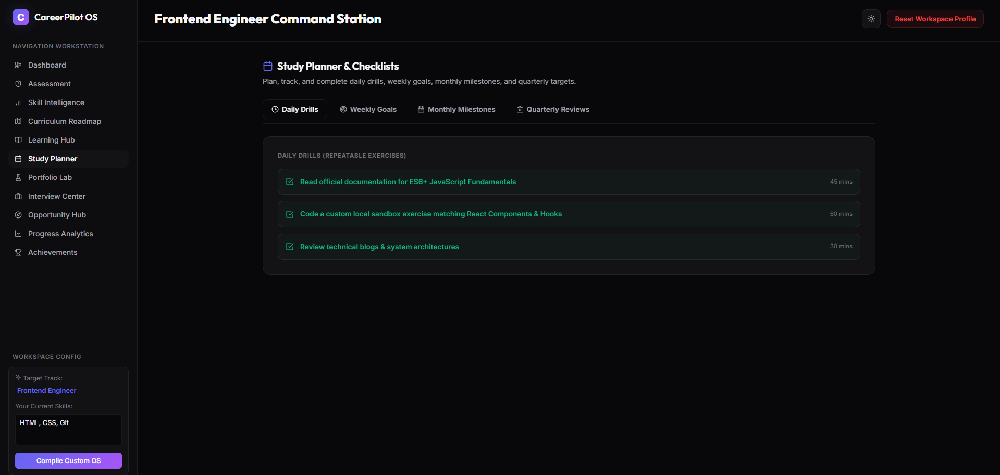 | 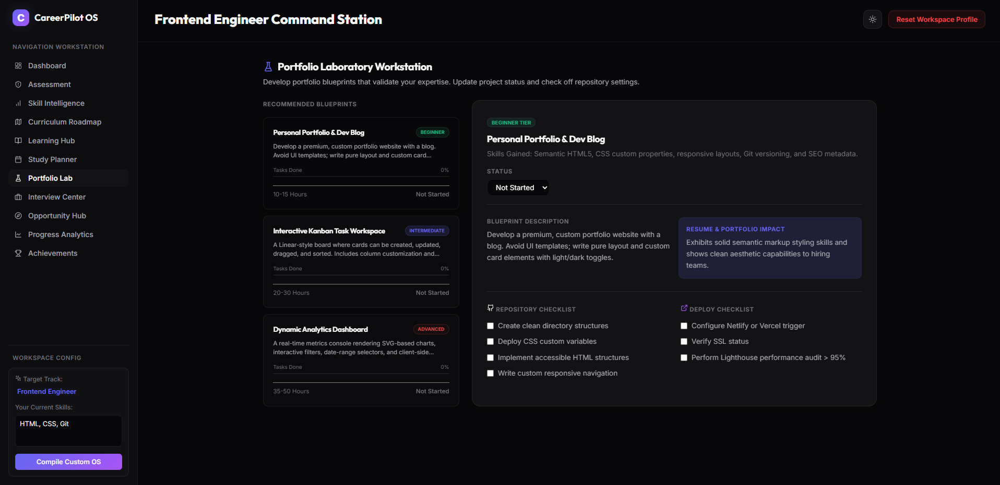 |

| Interview Center | Oportunity hub |
|---------------|------------------|
| 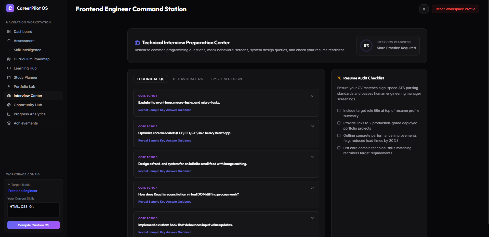 | 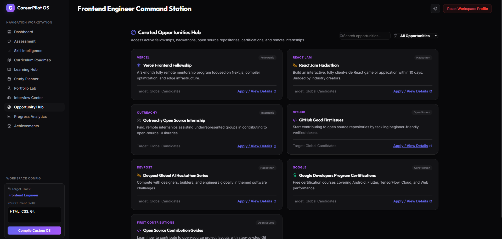 |

| Progress Analytics | Achivements |
|-----------------|--------------------|
| 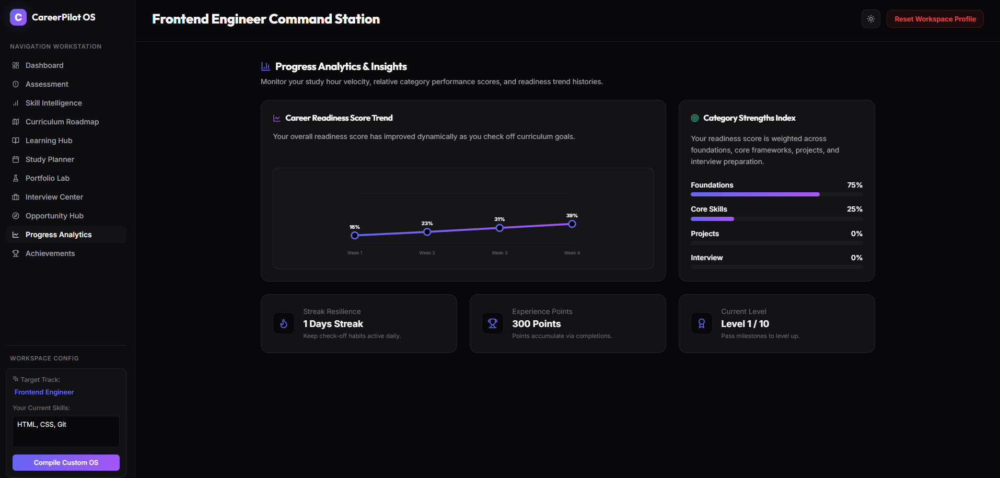 | 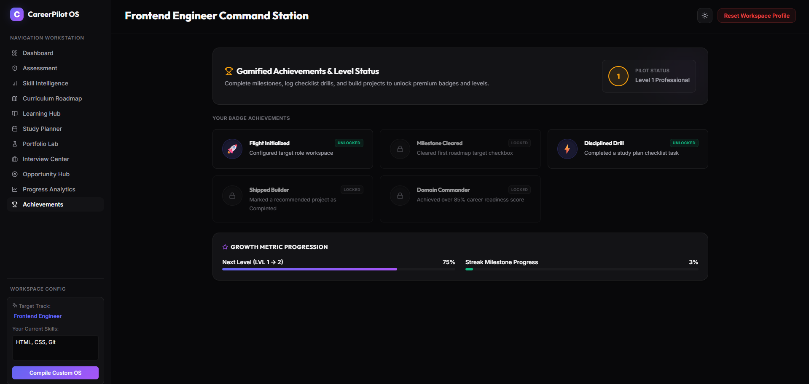 |

---

# 🚀 Future Improvements

- AI Resume Analyzer
- Live Job API Integration
- Real-time Market Trends
- Cloud Synchronization
- Authentication
- Portfolio Export
- AI Interview Evaluation
- Personalized AI Mentor

---

# 📄 License

MIT License
