# 🚀 CareerPilot OS — Professional Career Operating System

> An advanced, multi-agent AI-powered Career Operating System designed to assess skill gaps, map 8-phase pathways, curate resources, recommend projects, simulate interviews, and track gamified achievements.

---

## # Project Overview

CareerPilot OS is a professional, local-first SaaS platform that functions as a personal career cockpit. By leveraging local multi-agent intelligence, it dynamically maps out, audits, and accelerates individual learning paths for 9 major software development, data science, and security roles. 

## # Features

1. **Integrated Command Dashboard**: Answers key daily questions ("Where am I now?", "What should I study today?", "What is blocking my progress?", "What should I do next?") with progress visualizers.
2. **Career Assessment Agent**: Audits and maps a weighted career readiness score based on foundations, core tools, project experience, and interview performance.
3. **Skill Intelligence Agent**: Analyzes profile skills via fuzzy matching, organizing them into Strong, Intermediate, Weak, and Missing priorities.
4. **Interactive Curriculum Roadmap**: Splits curriculum into 8 collapsible phases with hourly milestones.
5. **Study Planner & Checklists**: Configures daily focus tasks, weekly milestones, monthly objectives, and quarterly reviews.
6. **Portfolio Laboratory**: Recommends customized, highly relevant blueprints with repository checklists and deployment tasks.
7. **Interview Center**: Offers behavioral, technical, and system design QA modules with local feedback loops.
8. **Opportunity Hub**: Curates hackathons, internships, fellowships, and certifications with searchable database fields.
9. **Achievements Cabinet**: Unlocks dynamic badges and generates completion certifications based on accumulated XP.

## # Why CareerPilot OS

Unlike static checklists, CareerPilot OS provides a closed-loop system where completed tasks automatically update XP, extend streaks, unlock badges, and recalculate career readiness in real-time, providing immediate feedback.

## # Technology Stack

- **Framework**: [React (v18)](https://react.dev/) & [Vite](https://vite.dev/)
- **Icons**: [Lucide React](https://lucide.dev/)
- **State & Data**: HTML5 LocalStorage for zero-dependency persistence.
- **Styling**: Vanilla CSS featuring modular variables, dark SaaS palettes, and premium interactive animations.

---

## # System Diagrams

Below are the 15 comprehensive Mermaid diagrams representing CareerPilot OS workflows and systems:

### 1. Complete System Architecture
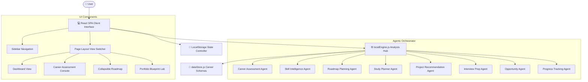

### 2. User Journey
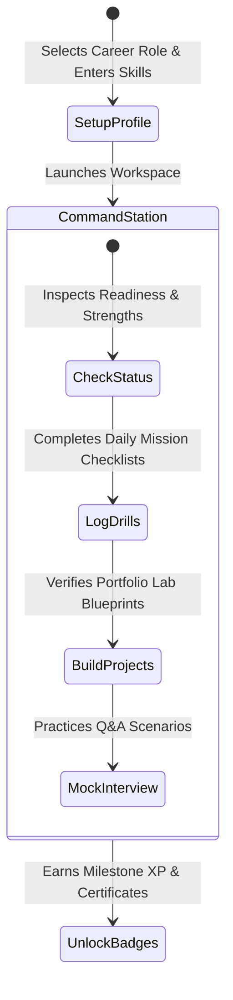

### 3. Multi-Agent Architecture
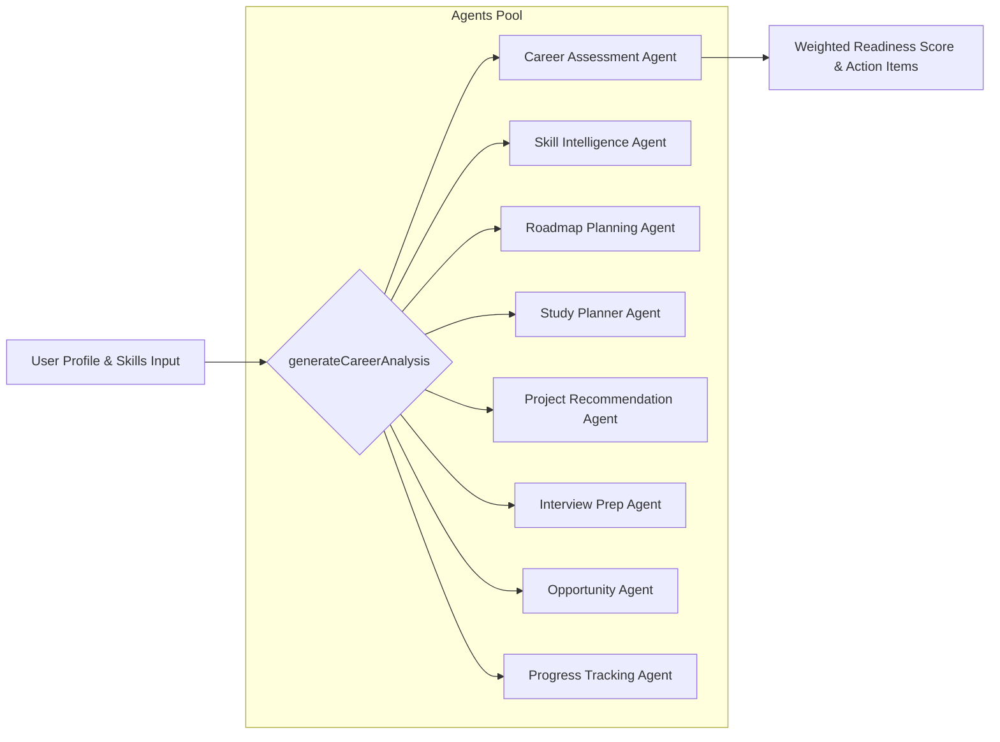

### 4. Career Analysis Workflow
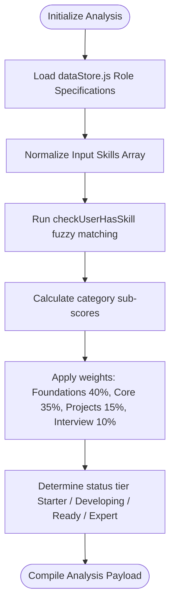

### 5. Skill Assessment Workflow
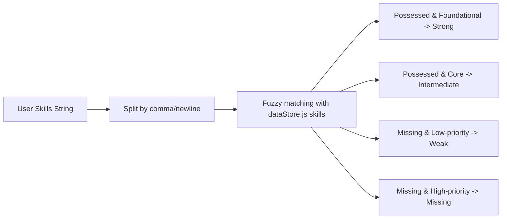

### 6. Roadmap Generation Workflow
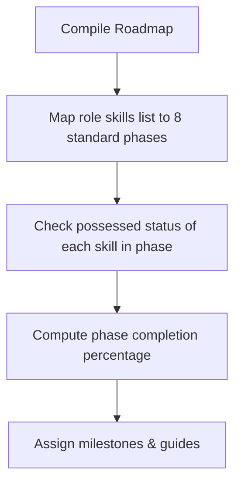

### 7. Study Planner Workflow
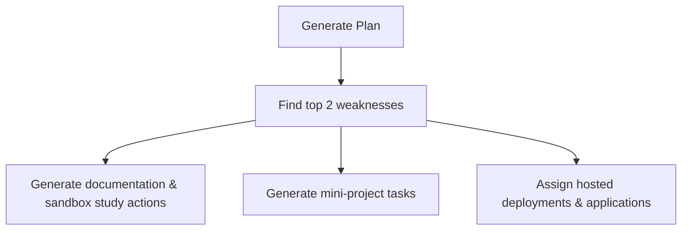

### 8. Portfolio Recommendation Workflow
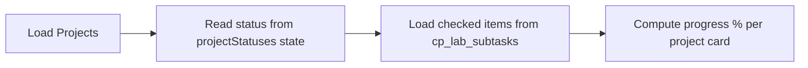

### 9. Interview Generation Workflow
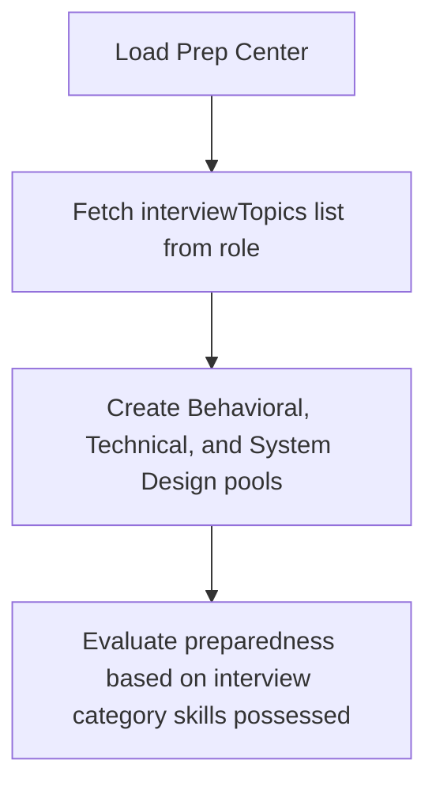

### 10. Opportunity Recommendation Workflow
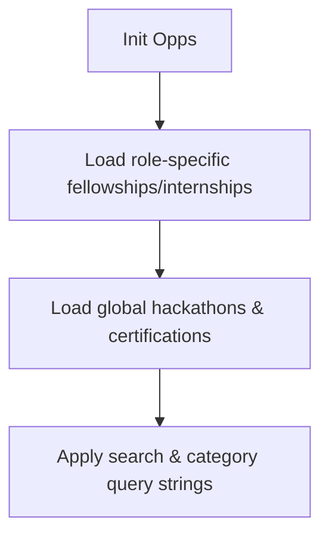

### 11. Progress Tracking Workflow
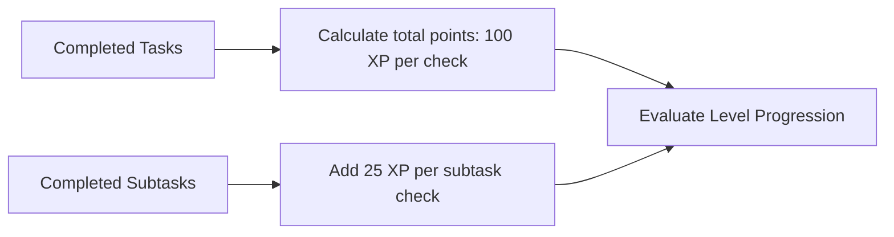

### 12. Application State Flow
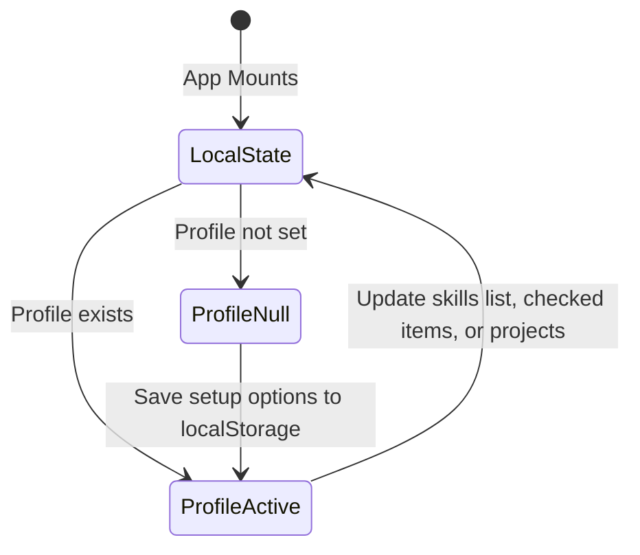

### 13. Component Interaction Diagram
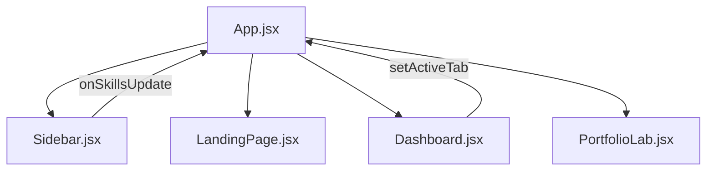

### 14. Data Flow Diagram
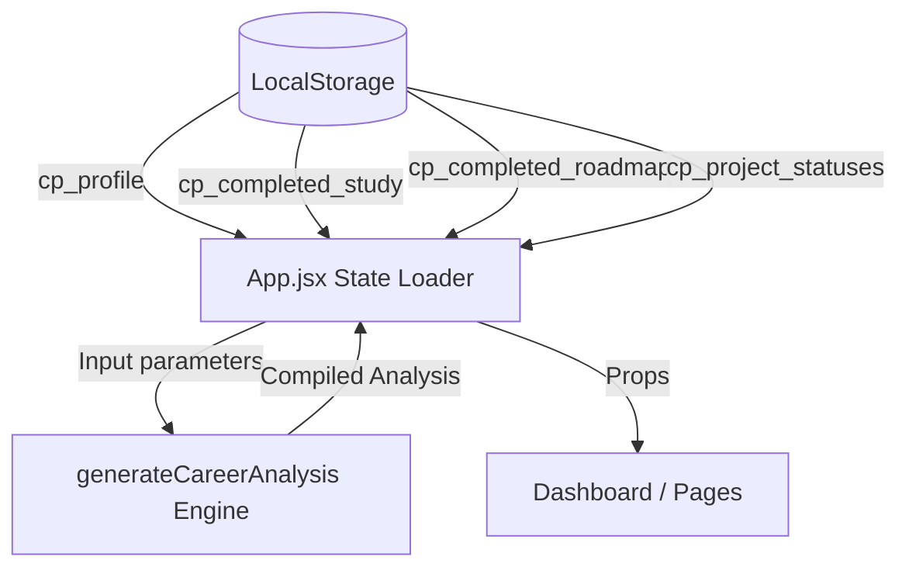

### 15. Sequence Diagram: Application Launch
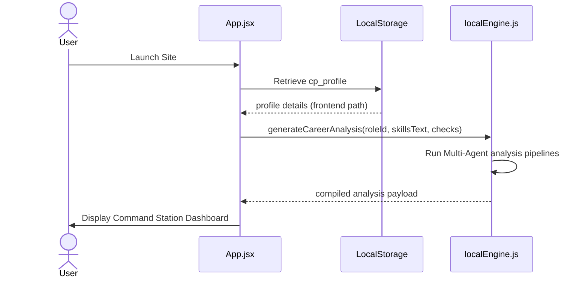

---

## # Project Structure

```text
├── src/
│   ├── components/            # Reusable UI component modules
│   ├── pages/                 # Full view layouts (Dashboard, Lab, Planner, etc.)
│   ├── services/              # localEngine.js & dataStore.js models
│   ├── styles/                # CSS variables, layouts, and pages
│   ├── App.jsx                # Router & State controller
│   └── main.jsx               # Entrypoint
```
## # Installation

1. Clone this repository:
   ```bash
   git clone https://github.com/your-username/careerpilot-os.git
   ```
2. Navigate to the project directory:
   ```bash
   cd careerpilot-os
   ```
3. Install dependencies:
   ```cmd
   npm install
   ```

## # Usage

Start the local server for development:
```cmd
npm run dev
```

Build the optimized production package:
```cmd
npm run build
```

## # Screenshots

*Command Station Dashboard view with circular readiness dials, progress widgets, and activity streams.*

## # Future Improvements

- Add local LLM integration utilizing WebGPU.
- Introduce portfolio export options.

## # License

MIT License. Copyright (c) 2026.
